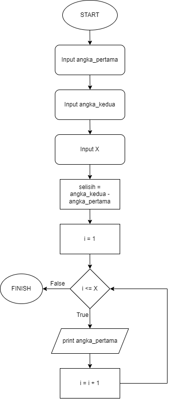

# Introduction

---

This is an explanation of each answer to the questions previously given

1. the answer for question no.1 is on file table.json

```json
{
  "master_po": {
    "kode_po": 1,
    "no_po": 2000000001,
    "tgl_po": "2020-09-24",
    "total_po": 232500.0,
    "approval": "Y",
    "tgl_approval": "2020-10-11",
    "userid": "Agus"
  },

  "detail_po": [
    {
      "kode_po": 1,
      "id_po": 0,
      "kode_item": "I.00000018",
      "deskripsi": "BB 4.2",
      "satuan": "BTG",
      "qty": 45,
      "harga": "2,500.00"
    },
    {
      "kode_po": 1,
      "id_po": 1,
      "kode_item": "I.00000218",
      "deskripsi": "BB 4.7",
      "satuan": "BTG",
      "qty": 21,
      "harga": "5000.00"
    },
    {
      "kode_po": 1,
      "id_po": 2,
      "kode_item": "I.000000312",
      "deskripsi": "BB 16 PSI",
      "satuan": "BTG",
      "qty": 10,
      "harga": "1,500.00"
    }
  ]
}
```

2.  the answer for question no.2 is on file pseudocode.txt and flowchart.drawio.png. for test the code, i make the code in deret_bilangan.php. run this code in your terminal

    ```bash
    php deret_bilangan.php
    ```

    ### pseudocode

    ```txt
    1. Input angka_pertama
    2. Input angka_kedua
    3. Input x
    6. Inisialisasi selisih = angka_kedua - angka_pertama
    7. Inisialisasi variable i = 1
    8. While i <= x:
    a. Print angka_pertama
    b. angka_pertama = angka_pertama + selisih
    c. i = i + 1
    ```

    ### Flowchart

    

3.  the answer for question no.3 is on file class_data.php. run this code in your terminal
    ```bash
    php class_data.php
    ```
4.  the answer for question no.4 i save it on file report.json. For the query i write it on query_omzet.txt

    ### Query SQL

        ```sql
        SELECT
        m.merchant_name,
        o.outlet_name,
        COALESCE(SUM(t.bill_total), 0) AS omzet_by_day

        FROM
        Merchants m
        JOIN
        Outlets o ON m.id = o.merchant_id
        LEFT JOIN
        Transactions t ON m.id = t.merchant_id
        AND o.id = t.outlet_id
        AND DATE(t.created_at) BETWEEN '2021-11-01' AND '2021-11-30'
        WHERE
        m.user_id = (SELECT id FROM Users WHERE user_name = 'admin1')
        GROUP BY
        m.merchant_name, o.outlet_name, DATE(t.created_at)
        ORDER BY
        m.merchant_name, o.outlet_name, DATE(t.created_at);

        ```

    ### Query results

```json
{
  "report": [
    {
      "merchant_name": "merchant_1",
      "outlet_name": "Outlet 1",
      "omzet_by_day": 4500
    },
    {
      "merchant_name": "merchant_1",
      "outlet_name": "Outlet 1",
      "omzet_by_day": 4000
    },
    {
      "merchant_name": "merchant_1",
      "outlet_name": "Outlet 1",
      "omzet_by_day": 1000
    },
    {
      "merchant_name": "merchant_1",
      "outlet_name": "Outlet 1",
      "omzet_by_day": 7000
    },
    {
      "merchant_name": "merchant_1",
      "outlet_name": "Outlet 1",
      "omzet_by_day": 2000
    },
    {
      "merchant_name": "merchant_1",
      "outlet_name": "Outlet 1",
      "omzet_by_day": 2500
    },
    {
      "merchant_name": "merchant_1",
      "outlet_name": "Outlet 1",
      "omzet_by_day": 5000
    },
    {
      "merchant_name": "merchant_1",
      "outlet_name": "Outlet 1",
      "omzet_by_day": 7000
    }
  ]
}
```
